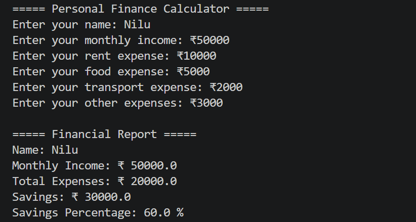

# 💰 Personal Finance Calculator
A beginner-friendly Python project that calculates monthly expenses, savings, and savings percentage.

## 🚀 Features
- Calculate total expenses
- Calculate savings amount
- Calculate savings percentage

## 🛠️ Technologies Used
- Python

## 📚 Concepts Used
- Variables
- Data Types
- Input/Output
- Type Conversion
- Arithmetic Operators
  
## 📸 Sample Output

## 🌱 Created as part of my Python Learning Journey.
